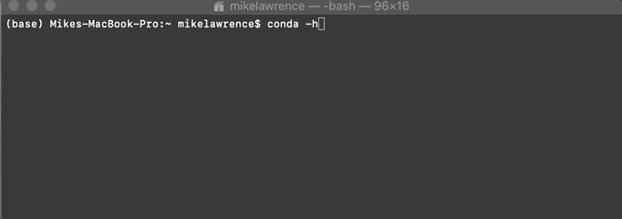
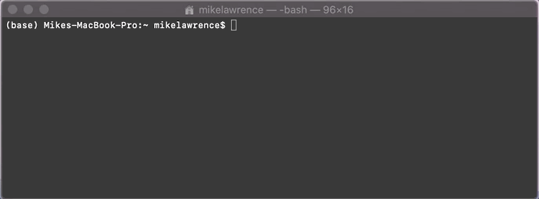

# Getting Started With Python Data Science Tools
Want to install Python and build an environment for working with data? You've come to the right place!

### Introduction
One of the most common difficulties people have when getting started with Python is the installation. 
Folks frequently have issues not only downloading Python itself, but managing the external tools, or packages. 
I'm going to walk you through using `conda` to build your first data science environment and hopefully avoid unnecessary trouble with what can be a messy install process.

I'm going to assume you have minimal background with using a terminal or command prompt,
but any experience you have will help.
Let's get started.

### Installation

1) #### Getting `conda`, our fancy new package manager
    
    `conda` gives us the ability to download python and other useful packages into an isolated environment.
    What this means is that we don't have to worry about breaking anything when we need to install a new tool because we can
    put everything directly into a safe, isolated box - our `conda` environment. If anything doesn't go the way we want, it's okay! 
    We can get rid of the environment and make a new one. If you want more background on `conda`, check out the documentation 
    [here](https://docs.conda.io/projects/continuumio-conda/en/latest/user-guide/getting-started.html).
    
    This process is a little easier if you're using MacOS or Linux, but Windows should work great!
    The respective links to download `conda` for each operating system are found in the following locations:
    
    * [Linux](https://docs.conda.io/projects/continuumio-conda/en/latest/user-guide/install/linux.html)
    * [MacOS](https://docs.conda.io/projects/continuumio-conda/en/latest/user-guide/install/macos.html)
    * [Windows](https://docs.conda.io/projects/continuumio-conda/en/latest/user-guide/install/windows.html)
    
    It doesn't matter whether you download `Anaconda` or `miniconda` - both give you the `conda` tool (`miniconda` has less bloat so I prefer it myself).
    
    To verify this step was done correctly, open a terminal/command prompt instance and type in `conda -h` (this asks the program for help). 
    If `conda` isn't recognized, you may need to restart your terminal. If problems persist, look back at the installation link for pointers.
   
    If you see a bunch of details about using the program, congrats, you're nearly done!
    
    

2) #### Creating our data science environment

    At this point, `conda` is working for you. Making a new environment isn't as scary as it may sound!
    In the [data science yaml file in this repo](./data-science-environment.yml), you'll notice that there is a Python version and many
    packages specified. These packages include common data science tools like `numpy` for fast math, 
    `matplotlib` for making plots, `jupyter` for running notebooks, `scikit-learn` for off-the-shelf machine learning,
    and both `tensorflow` and `keras` for getting your hands on the newest machine learning models. 
    Personally, I think `pymc3` is one of the best tools you can learn in this list as it provides a powerful interface
    for Bayesian machine learning. Let's continue.
    
    We're going to get these installed on your machine with the following easy steps:
    
    a) If you haven't already, download `data-science-environment.yml`
    
    b) Copy the path to its location. For example, for me it would be at `/Users/mike/Documents/GitHub/Python-for-Data-Science/data-science-environment.yml`.
    The details of getting the path vary among operating systems, but it's usually a right-click option. Google this if you're unsure.
    
    c) Open your terminal back up, and let's build our Python environment! The command is simple:
     ```   
     conda env create -f <path from step 2b>
     ``` 
    It will likely ask you if you'd like to install the packages mention in `[Y/n]` format. 
    Confirm and let `conda` handle the rest!
    
3) #### Accessing the environment
    Congratulations! You now have a Python environment available with a ton of great data science tools! 
    
    Accessing these packages is really simple. Since our environment is simply called `data-science-environment`,
    we make the python environment available with the following command:
    ```
    conda activate data-science-environment
    ```
     
   
     
     
...and that's really all there is to it! If this environment is active, you can run Python scripts using any of the powerful packages with no additional effort, or even modify the `.yml` file to create a new, 
reproducible environment of your own! 


### Optional: Setting up Jupyter notebooks
In progress
  